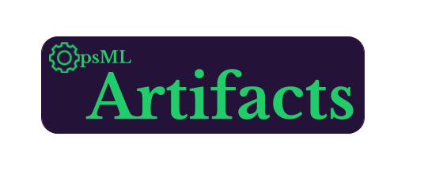

<h1 align="center">
   
  
   
</h1>

<h4 align="center">Trading cards for machine learning workflows.</h4>

  <a href="https://drone.shipt.com/shipt/py-opsml">
  

  <a href="https://www.python.org/downloads/release/python-390/">
  

  

  <a href="https://sonarqube.shipt.com/dashboard?id=shipt_opsml-artifacts_AYWcv6FFE00GGQFT3YPq">
  

  <a href="https://sonarqube.shipt.com/dashboard?id=shipt_opsml-artifacts_AYWcv6FFE00GGQFT3YPq">
  

  <a href="#key-features">What is it?</a> •
  <a href="#how-to-use">Features</a> •
  <a href="#download">Download</a> •
  <a href="#credits">Credits</a> •
  <a href="#related">Related</a> •
  <a href="#license">License</a>

## What is it?

`OpsML-Artifacts` is a library for tracking,  storing, versioning, and reproducing artifacts (aka Artifact Cards) across the ML-lifecycle. Think of it as trading cards for machine learning.

  

## Features:
  - Simple Design:  Standardized design for all card types and registries to make switching between and registering different types easy.

  - Automation: Automatic type checking for card attributes. Automated processes depending on card type (Onnx conversion for model, api signature generation, data schema creation)

  - Short: Easy to integrate into your existing workflows. You just need a card type and a registry to get started

