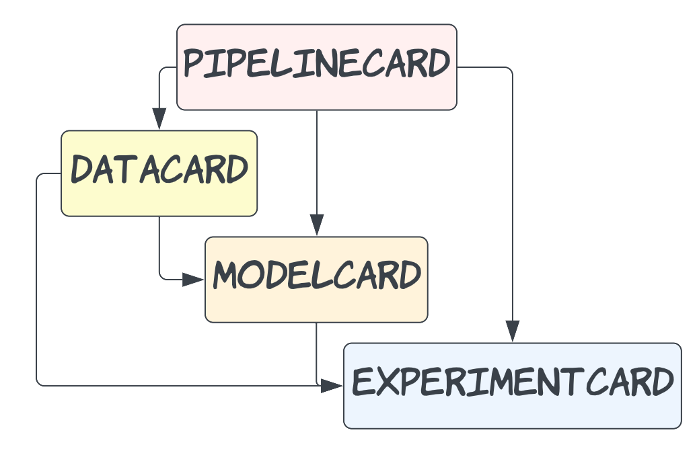
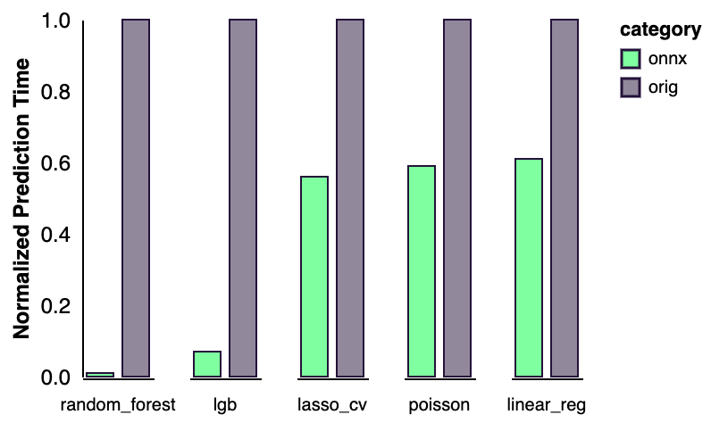

<h1 align="center">
  <br>
  
  <br>
</h1>

<h4 align="center">Trading cards for machine learning workflows</h4>

<p align="center">
  <a href="https://drone.shipt.com/shipt/py-opsml">
  

  <a href="https://www.python.org/downloads/release/python-390/">
  

  

  <a href="https://sonarqube.shipt.com/dashboard?id=shipt_opsml-artifacts_AYWcv6FFE00GGQFT3YPq">
  

  <a href="https://sonarqube.shipt.com/dashboard?id=shipt_opsml-artifacts_AYWcv6FFE00GGQFT3YPq">
  
</p>

<h4 align="left">Supported Model Types</h4>

<a href="https://www.tensorflow.org/">
  

<a href="https://keras.io/">
  

<a href="https://pytorch.org/">
  

<a href="https://scikit-learn.org/stable/">
  


<a href="https://xgboost.readthedocs.io/en/stable/">
  


<a href="https://lightgbm.readthedocs.io/en/v3.3.2/">
  

</p>

<p align="center">
  <a href="#what-is-it">What is it?</a> •
  <a href="#features">Features</a> •
  <a href="#installation">Installation</a> •
  <a href="#create-a-card">Create a Card</a> •
  <a href="#datacard">DataCard</a> •
  <a href="#modelcard">ModelCard</a> •
  <a href="#modelcard-predictor">ModelCard Predictor</a> •
  <a href="#benchmarks">Benchmarks</a> •
  <a href="#contributing">Contributing</a> 
</p>

## What is it?

`OpsML-Artifacts` is a library for tracking,  storing, versioning, and reproducing artifacts (aka Artifact Cards) across the ML-lifecycle. Think of it as trading cards for machine learning.

<p align="center">
  
</p>

## Features:
  - **Simple Design**:  Standardized design for all card types and registries to make switching between and registering different cards easy.

  - **Automation**: Automatic type checking (the power of pydantic!) for card attributes. Automated processes depending on card type (Onnx conversion for model, api signature generation, data schema creation)

  - **Short**: Easy to integrate into your existing workflows. You just need a card type and a registry to get started

## Installation:
Before installing, you will need to set up your Artifactory credentials.

#### Request credentials for [Artifactory](https://techhub.shipt.com/engineering/infrastructure/devops/artifactory/) in Slack `#ask-info-sec`

Once you have your credentials, set the following variables.
```bash
export POETRY_HTTP_BASIC_SHIPT_RESOLVE_USERNAME=your_username
export POETRY_HTTP_BASIC_SHIPT_RESOLVE_PASSWORD=your_password
```

If using poetry, you must also add the following in your `pyproject.toml`
```toml
[[tool.poetry.source]]
name = "shipt-resolve"
url = "https://artifactory.shipt.com/artifactory/api/pypi/pypi-virtual/simple"
default = true
```

Next, add opsml-artifacts to your environment
```bash
poetry add opsml-artifacts
```

## SQL DB Resources

`OpsML-Artifacts` currently works out of the box with a local SQLite database or GCP CloudSQL. If you would like to use GCP resources you will need to configure you GCP credentials in 1 or 2 ways.

1. Set `GOOGLE_ACCOUNT_JSON_BASE64` as an env variable. This key can be found in our slack channel.

```bash
export GOOGLE_ACCOUNT_JSON_BASE64='our shared key'
```

2. Install the [google cloud sdk](https://cloud.google.com/sdk/docs/install) and make sure you are added to our core gcp project (tbd)


## Connecting to the ArtifactCard registries
When connecting to the ArtifactCard registries you will need to supply either a connection client or pass a connection type (string). 

### Local Connection
Run the following to create a local connection

```python
from opsml_artifacts import LocalSQLConnection

local_conn = LocalSQLConnection()
```

### GCP Cloud SQL
There are a few ways to create a Cloud SQL connection

```python
from opsml_artifacts import CloudSQLConnection

cloud_sql = CloudSQLConnection(
    gcp_project="your_gcp_project",
    gcs_bucket="your_gcs_bucket",
    gcp_region="your_gcp_region",
    db_instance_name="your_db_instance_name",
    db_name="your_db_name",
    db_username="your_username",
    db_password="your_password",
    db_type="mysql"
    )
```

In the example above, we created a cloud sql connection by manually inputing the required args.

If you prefer not to do this, you can also set these required args as env variables using the "OPSML" prefix (e.g. `OPSML_GCP_PROJECT`)

It's also possible to use GCP Secret Manager to set and call the required args (same naming convention as with env vars). Make sure your user credentials or the service account credentials have access to read these secrets.

```python
cloud_sql = CloudSQLConnection(load_from_secrets=True)
```

You will see how to use these connections in the examples below

## Create a Card

Think of ArtifactCards as trading cards that you can link together in a set or deck. Each card can exist independently and provides descriptive information related to the card type.

<p align="center">
  
</p>

There are 4 card types in `Opsml-Artifacts`.

Card Types:
- `DataCard`: Card used to store data-related information (data, dependent variables, feature descriptions, split logic, etc.)
- `ModelCards`: Card used to store trained model and model information
- `ExperimentCard`: Stores artifact and metric info related to Data, Model, or Pipeline cards.
- `PipelineCard`: Stores information related to training pipeline and all other cards created within the pipeline (Data, Experiment, Model)

Quit the yapping and show me an example!

## DataCard
The following example shows how to create a DataCard. For more information on what you can do with DataCards, refer to additional examples in the example dir.

```python
from opsml_artifacts import SnowflakeQueryRunner, DataCard, CardRegistry, LocalSQLConnection

query_runner = SnowflakeQueryRunner(on_vpn=True) #query runner is a temporary wrapper for pyshipt sql (needed for network issues in vertex, see opsml-pipelines docs)

dataframe = query_runner.query_to_dataframe(sql_file="data.sql") #executes sql file or raw sql. data.sql is in examples dir

# Subset features
features = [
    "NBR_ADDRESSES",
    "NBR_ORDERS",
    "NBR_RX",
    "NBR_APT",
    "METRO_X",
    "METRO_Y",
    "METRO_Z",
    "APT_FLG",
    "DROP_OFF_TIME",
    "EVAL_FLG",
]
DEPENDENT_VAR = "DROP_OFF_TIME"

# Define DataCard attributes (see examples dir for more detailed information)
DATA_NAME = "tarp_drop_off"
TEAM = "SPMS"
USER_EMAIL = "steven.forrester@shipt.com"
DATA_SPLITS = [
    {"label": "train", "column": "EVAL_FLG", "column_value": 0},
    {"label": "test", "column": "EVAL_FLG", "column_value": 1},
]

# Create DataCard
data_card = DataCard(
    data=dataframe[features],
    name=DATA_NAME,
    team=TEAM,
    user_email=USER_EMAIL,
    data_splits=DATA_SPLITS,
    dependent_vars=[DEPENDENT_VAR],
)

#register card
data_registry = CardRegistry(registry_name="data", connection_client=local_conn) # CardRegistry accepts "data", "model", "pipeline" and "experiment"
data_registry.register_card(card=data_card)
```

#### Output
```bash
{"message": "DATA_REGISTRY: tarp_drop_off registered as version 2", "timestamp": "2023-02-09T00:57:22.131787Z", "app_env": "development", "level": "INFO"}
```

### Searching for and Loading Existing DataCards
```python
from opsml_artifacts import CardRegistry, LocalSQLConnection

local_conn = LocalSQLConnection()
data_registry = CardRegistry(registry_name="data", connection_client=local_conn)
tarp_list = data_registry.list_cards(team="SPMS", name="tarp_drop_off")

print(tarp_list.loc[:, ~tarp_list.columns.isin(["feature_map", "data_splits", "drift_uri"])].to_markdown()) # Filter some of the columns for readability
```
#### Output
|    | uid                              | date       |     timestamp | app_env     | name          | team   |   version | user_email                 | data_uri                                                                                                   | feature_descriptions   | data_type   | additional_info   | dependent_vars    |
|---:|:---------------------------------|:-----------|--------------:|:------------|:--------------|:-------|----------:|:---------------------------|:-----------------------------------------------------------------------------------------------------------|:-----------------------|:------------|:------------------|:------------------|
|  0 | e18e5bd3fbb145a182d0fe61e24b1d66 | 2023-02-09 | 1675904151384 | development | tarp_drop_off | SPMS   |         2 | steven.forrester@shipt.com | /home/steven.forrester/DATA_REGISTRY/SPMS/tarp_drop_off/version-2/6de7a703618e4718a39f301b50dda8dc.parquet |                        | DataFrame   | {}                | ['DROP_OFF_TIME'] |
|  1 | 66f62d5cb36b43939f45d3dc6ed1244a | 2023-02-09 | 1675904151384 | development | tarp_drop_off | SPMS   |         1 | steven.forrester@shipt.com | /home//DATA_REGISTRY/SPMS/tarp_drop_off/version-1/3bb215cfb7634d95992d6f6a1a6ecc26.parquet |                        | DataFrame   | {}                | ['DROP_OFF_TIME'] |

```python

data_card = data_registry.load_card(uid="e18e5bd3fbb145a182d0fe61e24b1d66") 
data_card.load_data() # data is not automatically loaded with the card (prevents loading issues with big data)
# load_card can take a few arguments. Be sure to check to docstring
print(loaded_card.data.head().to_markdown())
```

#### Output
|    |   NBR_ADDRESSES |   NBR_ORDERS |   NBR_RX |   NBR_APT |   METRO_X |   METRO_Y |   METRO_Z |   APT_FLG |   DROP_OFF_TIME |   EVAL_FLG |
|---:|----------------:|-------------:|---------:|----------:|----------:|----------:|----------:|----------:|----------------:|-----------:|
|  0 |               1 |            1 |        0 |         0 |   824.547 |  -5135.84 |   3678.71 |         0 |         4.39407 |          0 |
|  1 |               2 |            2 |        0 |         0 | -2498.36  |  -3835.84 |   4431.04 |         0 |         9.75429 |          0 |
|  2 |               6 |            6 |        0 |         1 |  -676.719 |  -5314.67 |   3447.6  |         1 |        20.2536  |          0 |
|  3 |               1 |            2 |        0 |         0 | -2499.95  |  -4649.47 |   3566.83 |         0 |         8.03023 |          0 |
|  4 |               2 |            2 |        0 |         2 | -2476.13  |  -4684.47 |   3537.54 |         1 |        11.7914  |          0 |

## ModelCard
The following example shows how to create a ModelCard. For more information on what you can do with ModelCards, refer to additional examples in the example dir.

- We will use the DataCard from the previous example to train a model and create a ModelCard

```python
from opsml_artifacts import ModelCard
from lightgbm import LGBMRegressor

model_registry = CardRegistry(registry_name="model", connection_client=local_conn) #load the model registry

data_splits = data_card.split_data() # get the data splits defined by split logic (data_card.data_splits)

# Prepare train data
data_splits.train.pop("EVAL_FLG") # pop off eval flg
y_train = data_splits.train.pop("DROP_OFF_TIME") # get train target

# Prepare test data
data_splits.test.pop("EVAL_FLG") # pop off eval flg
y_test = data_splits.test.pop("DROP_OFF_TIME") # get test target

# fit model
lgb_model = LGBMRegressor()
lgb_model.fit(data_splits.train, y_train)

model_card = ModelCard(
    trained_model=lgb_model,
    sample_input_data=data_splits.train[:10],
    name="tarp_lgb",
    team=TEAM, # defined above
    user_email=USER_EMAIL, # defined above
    data_card_uid=data_card.uid # this is required if you are planning on registering the model
)

model_registry = CardRegistry(registry_name="model", connection_client=local_conn)
model_registry.register_card(card=model_card)
```
#### Output

```bash
{"level": "INFO", "message": "Registering lightgbm onnx converter", "timestamp": "2023-02-09T01:04:18.498558Z", "app_env": "development", "host": null, "pid": 742575}
{"level": "INFO", "message": "Validating converted onnx model", "timestamp": "2023-02-09T01:04:18.808954Z", "app_env": "development", "host": null, "pid": 742575}
{"level": "INFO", "message": "Onnx model validated", "timestamp": "2023-02-09T01:04:18.841828Z", "app_env": "development", "host": null, "pid": 742575}
{"message": "MODEL_REGISTRY: tarp_lgb registered as version 1", "timestamp": "2023-02-09T01:04:18.874386Z", "app_env": "development", "level": "INFO"}
```

ModelCardCreator returns a ModelCard containing your model serialized into Onnx format

## ModelCard Predictor
ModelCards create serialized onnx model definitions from the provided model. The onnx model implementation can be accessed through `your_model_card.onnx_model()`. Onnx models are also created when registering a model card.

```python
onnx_model = model_card.onnx_model()

# Checkout the automated api sig (inferred from training data sample)
onnx_model.input_sig.schema()
```

```text
{'title': 'Features',
 'type': 'object',
 'properties': {'NBR_ADDRESSES': {'title': 'Nbr Addresses', 'type': 'integer'},
  'NBR_ORDERS': {'title': 'Nbr Orders', 'type': 'integer'},
  'NBR_RX': {'title': 'Nbr Rx', 'type': 'integer'},
  'NBR_APT': {'title': 'Nbr Apt', 'type': 'integer'},
  'METRO_X': {'title': 'Metro X', 'type': 'number'},
  'METRO_Y': {'title': 'Metro Y', 'type': 'number'},
  'METRO_Z': {'title': 'Metro Z', 'type': 'number'},
  'APT_FLG': {'title': 'Apt Flg', 'type': 'integer'}},
 'required': ['NBR_ADDRESSES',
  'NBR_ORDERS',
  'NBR_RX',
  'NBR_APT',
  'METRO_X',
  'METRO_Y',
  'METRO_Z',
  'APT_FLG']}
```

```python
# FastAPI models (like our production ML apis) expect a dictionary as input
# Our input data was a pandas schema, so lets convert that
# Numpy arrays are also supported 
record = data_splits.test[0:1].to_dict(orient='records')[0]

# if testing a model that was trained on a numpy array, the model will expect a dictionary with a single list
# record = {"data": list(np.ravel(data[:1]))}

# test the onnx model 
onnx_pred = float(np.ravel(onnx_model.predict(record))[0])

# Compare to original model
orig_pred = float(onnx_model.predict_with_model(model_card.trained_model, record)[0])

print(f"Onnx: {round(onnx_pred,4)}", f"Lightgbm: {round(orig_pred,4)}")
```

```text
Onnx: 7.1003 Lightgbm: 7.1003
```

## Benchmarks
 - The following shows the performance imporvements of using a serialized onnx model vs its python equivalent (time for 1000 single predictions)
 - All times were normalized to the python model time

<p align="left">
  
</p>


## Contributing
- If you'd like to contribute, feel free to create a branch and start adding in your edits. If you'd like to work on any outstanding items, check out the `to_dos` directory readme and get started :smiley: