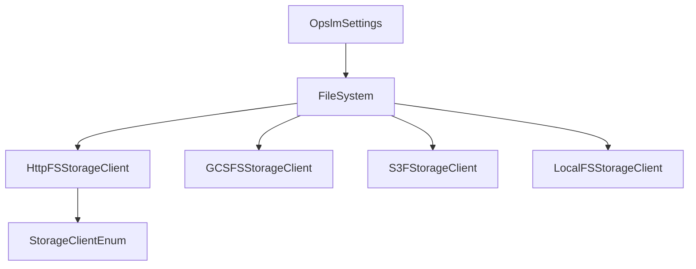
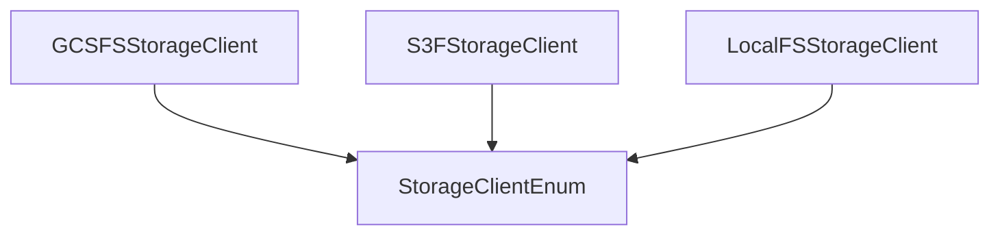

# Opsml Storage
This repository container the storage layer for the Opsml project. It consists of both rust and python interfaces for interacting with various storage backends.

## FileSystem Top-level interface
The **FileSystem** interface is the top-level abstraction for interacting with the storage backends. It takes OpsmlSettings and configures a storage backend based on the settings.

## StorageClientEnum
The **StorageClientEnum** is an enum that contains all the supported storage backends. It is used to configure the storage backend based on the settings and is used with the HttpFSStorageClient for presigning URLs.

