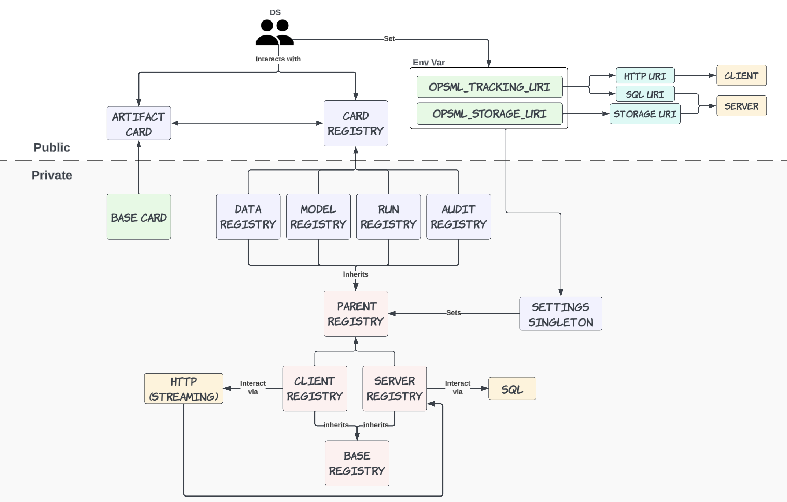
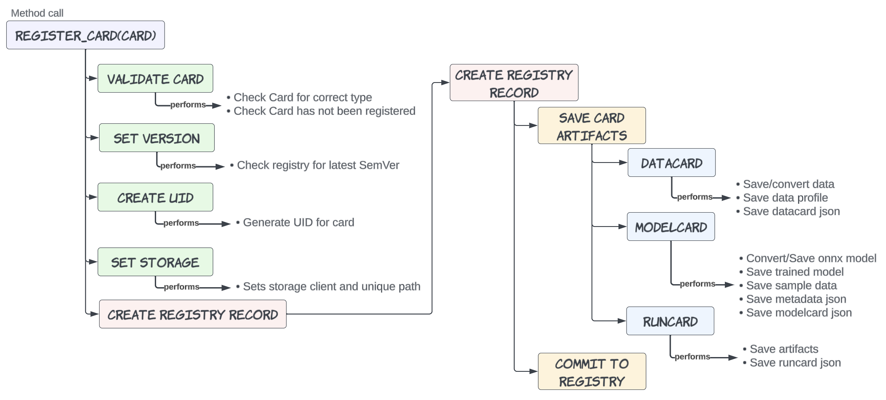

# How OpsML Works

The following sections describe specific components of OpsML and how they work.

### DS Interfaces

{ align=center }

`Opsml` provides a few public interfaces for DSs to use while abstracting and hiding the underlying implementation details. These interfaces are the `ArtifactCard` (`DataCard`, `ModelCard`, `RunCard`, etc.) and the `CardRegistry`. Every `ArtifactCard` type is associated with a `CardRegistry` type. Upon instantiation, a DS provides a type to the `CardRegistry` in order to load the unique registry. Under the hood, each registry inherits from either a `Client` registry or a `Server` registry, which is dependent upon the local `OpsML` environment variables. If the `OPSML_TRACKING_URI` is set with an http or https uri corresponding to an `OpsML` server, then the registry will be a `Client` registry. If the `OPSML_TRACKING_URI` is set with a SQL connection string, then the registry will be a `Server` registry. The settings singleton is used to determine which parent registry to instantiate.

### Card Registration

Each card follows the following flow when being registered. Implementation details for each card type may be different, but the general flow is the same.

{ align=center }

Steps upon registration (**register_card**):

- **Validate Card**: 
    - Each card is validated for (1) the card type matches the registry type and (2) the card has not been registered before

- **Set Version**: 
    - Card registry is queried for the latest `Semver` for the given model name. A new version is then created based on latest version and version increment type.

- **Create UID**: 
    - A unique ID is created and applied to the card

- **Set Storage**: 
    - A unique storage path is created and the storage client is updated

- **Create Registry Record**: 
    - **Save Card Artifacts**:
      - Each `ArtifactCard` has a set of artifacts that are saved to storage. These artifacts are saved to storage and the storage paths are updated in the card and metadata
    - **Create Registry Record**:
      - A registry record is generated from card metadata and committed to the registry

