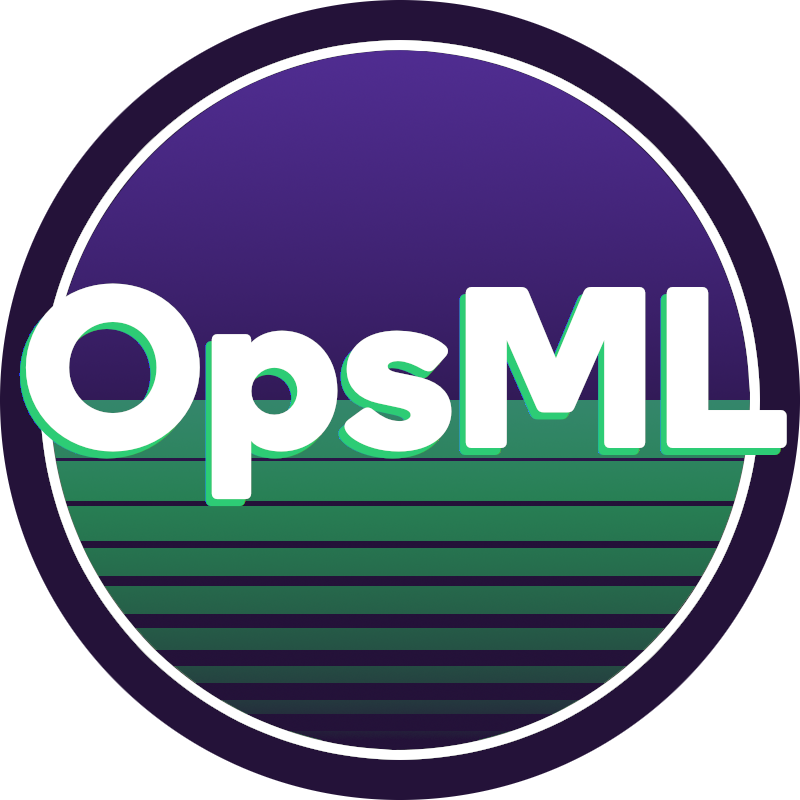

<p align="center">
  
</p>

<h4 align="center">Tooling for machine learning workflows</h4>

---

<p align="center">
  <a href="https://drone.shipt.com/shipt/opsml">
  
  </a>

  <a href="https://www.python.org/downloads/release/python-390/">
  
  </a>

  

  <a href="https://sonarqube.shipt.com/dashboard?id=shipt_opsml-artifacts_AYWcv6FFE00GGQFT3YPq">
  
  </a>

  <a href="https://sonarqube.shipt.com/dashboard?id=shipt_opsml-artifacts_AYWcv6FFE00GGQFT3YPq">
  
  </a>
</p>

<h4 align="left">Supported Model Types</h4>

<p align="center">

<a href="https://www.tensorflow.org/">
  
</a>

<a href="https://keras.io/">
  
</a>

<a href="https://pytorch.org/">
  
</a>

<a href="https://scikit-learn.org/stable/">
  
</a>

<a href="https://xgboost.readthedocs.io/en/stable/">
  
</a>

<a href="https://lightgbm.readthedocs.io/en/v3.3.2/">
  
</a>
</p>


**Source Code**: [Code](https://github.com/shipt/opsml)

## What is it?
`OpsML` is a tooling library that simplifies the machine learning project lifecycle.

## Features

  - `Shareable`: Share cards and workflows across teams
  
  - `Simple Design`: Standardized design that can easily be incorporated into existing workflows.

  - `Cards`: Track, version, and store a variety of ML artifacts via cards (data, models, runs, pipelines) and a SQL-based card registry system. Think "trading cards for machine learning".

  - `Automation`: Automated processes including Onnx model conversion, api generation from Onnx model, data schema inference, code conversion and packaging for production.
  
  - `Pipelines`: Coming soon. Auto-pipeline creation

## Why?

`Opsml` is not re-inventing the wheel nor is it creating anything that already isn't out there. However, what it does do is stitch different ideas/tooling together and standardize machine learning workflows with a focus on developer and data scientist experience, speed-to-deployment, reproducibility, and auditability.

### Two sides of the same coin (dev as prod)

Taking a data science project from ideation :bulb: to deployment :rocket: often involves a `dev` side and a `deployment` side. 

#### Dev Themes:

- Experimentation and iteration in order to generate many potential solutions
- Feature/Data engineering
- Algorithm development
- Felxible work environment (often **Jupyter Notebooks**)
- Many other things

#### Deployment Themes:

- Compute infrastructure for hosting
- Conversion of data science code to production code (including creating dags/pipelines)
- CI/CD
- Versioning
- Monitoring
- Security

#### Resulting Pain Points

- :angry: Overhead in packaging data science code into production code. This results in duplicating data science code just to run in another environment (necessary, but can this be simplified?). 

- :watch: Time lag in deployment due to different teams having different priorities (especially true if developers/ML engineers are needed to help data scientists deploy their code)

- :rage: Inflexible prod code that is not easily updatable

- :sob: Often no linking of metadata across the entire workflow (data, runs/experiments, models, pipelines)

What `Opsml` aims to do is provide an interface into both sides and simplify the entire workflow experience by removing non-value added time from `dev` and `deployment` processes and help teams go from ideation to deployment quicker :smile: with the added benefits of reproducibility and auditability.


## Installation

Before installing, you'll need to set up your Artifactory credentials.

**Request credentials for [Artifactory](https://techhub.shipt.com/engineering/infrastructure/devops/artifactory/) in Slack `#ask-info-sec`**

Once you have your credentials, set the following variables.
```bash
export POETRY_HTTP_BASIC_SHIPT_RESOLVE_USERNAME=your_username
export POETRY_HTTP_BASIC_SHIPT_RESOLVE_PASSWORD=your_password
```

If using poetry, you must also add the following in your `pyproject.toml`
```toml
[[tool.poetry.source]]
name = "shipt-resolve"
url = "https://artifactory.shipt.com/artifactory/api/pypi/pypi-virtual/simple"
default = true
```

Next, add opsml to your environment
```bash
poetry add opsml
```
## Optional Dependencies
`Opsml` is designed to work with a variety of 3rd-party integrations depending on your use-case.

Types of extras that can be installed:

- **Postgres**: Installs postgres pyscopg2 dependency to be used with `Opsml`
  ```bash
  poetry add opsml[postgres]
  ```

- **Server**: Installs necessary packages for setting up an `Fastapi`/`Mlflow` based `Opsml` server
  ```bash
  poetry add opsml[server]
  ```

- **Mlflow**: Installs Mlflow for client-side interaction with an `Opsml` server
  ```bash
  poetry add opsml[mlflow]
  ```

- **GCP-mysql**: Installs mysql and cloud-sql gcp dependencies to be used with `Opsml`
  ```bash
  poetry add opsml[gcp_mysql]
  ```

- **GCP-postgres**: Installs postgres and cloud-sql gcp dependencies to be used with `Opsml`
  ```bash
  poetry add opsml[gcp_postgres]
  ```


## Environment Variables
`Opsml` requires 1 or 2 environment variables depending on if you are using it as an all-in-one interface (no proxy) or you are using it as an interface to interact with an `Opsml` server (details on how to set up an `Opsml` server are below (TODO))
 
- **OPSML_TRACKING_URI**: This is the sql tracking uri to your card registry database. If interacting with an `Opsml` server, this will be the http address of the server. If this variable is not set, it will default to a local `SQLite` connection.

- **OPSML_STORAGE_URI**: This is the storage uri to use for storing ml artifacts (models, data, figures, etc.). `Opsml` currently supports local file systems and google cloud storage.
If running `Opsml` as an all-in-one interfact, this variable is required and will default to a local folder if not specified. If interacting with an `Opsml` server, this variable does not need to be set.

## Example

The primary interface for `Opsml` is an `ArtifactCard` (see [here](cards/overview.md) for detailed information). All Cards within `Opsml` follow the same design with a few specific required arguments for each card type. The following example shows how to create a DataCard and a ModelCard.

```python
# Data and Model
from sklearn.datasets import load_linnerud
from sklearn.linear_model import LinearRegression
from sklearn.model_selection import train_test_split
import numpy as np

# Opsml
from opsml.registry import CardInfo, DataCard, CardRegistry, ModelCard

# set up registries
data_registry = CardRegistry(registry_name="data")
model_registry = CardRegistry(registry_name="model")

# card info (optional, but is used to simplify required args a bit)
card_info = CardInfo(name="linnerrud", team="opsml", user_email="user@email.com")

# get X, y
data, target = load_linnerud(return_X_y=True, as_frame=True)
data["Pulse"] = target.Pulse

# Split indices
indices = np.arange(data.shape[0])

# usual train-test split
train_idx, test_idx = train_test_split(indices, test_size=0.2, train_size=None)

datacard = DataCard(
    info=card_info,
    data=data,
    dependent_vars=["Pulse"],
    # define splits
    data_splits=[
        {"label": "train", "indices": train_idx},
        {"label": "test", "indices": test_idx},
    ],
)

# register card
data_registry.register_card(datacard)

# split data
data_splits = datacard.split_data()
X_train = data_splits.train
y_train = data_splits.train.pop(datacard.dependent_vars[0])

# fit model
linreg = LinearRegression()
linreg = linreg.fit(X=X_train, y=y_train)

# Create ModelCard
modelcard = ModelCard(
    info=card_info,
    trained_model=linreg,
    sample_input_data=X_train,
    datacard_uid=datacard.uid,
)

model_registry.register_card(card=modelcard)

# >{"level": "INFO", "message": "OPSML_DATA_REGISTRY: linnerrud, version:1.0.0 registered", "timestamp": "2023-04-27T19:12:30", "app_env": "development"}
# >{"level": "INFO", "message": "Validating converted onnx model", "timestamp": "2023-04-27T19:12:30", "app_env": "development"}
# >{"level": "INFO", "message": "Onnx model validated", "timestamp": "2023-04-27T19:12:30", "app_env": "development"}
# >{"level": "INFO", "message": "OPSML_MODEL_REGISTRY: linnerrud, version:1.0.0 registered", "timestamp": "2023-04-27T19:12:30", "app_env": "development"}


print(data_registry.list_cards(info=card_info, as_dataframe=False))
print(model_registry.list_cards(info=card_info, as_dataframe=False))
```
*(Code will run as-is)*

Outputs:

```json
# data registry output
[
    {
        "uid": "3fa6f762c5b74d4289b1e52bfd66f158",
        "app_env": "development",
        "team": "opsml",
        "user_email": "user@email.com",
        "datacard_uid": "873978bf4c3a49be819b9813f8d02ae8",
        "onnx_model_uri": "/***/***/opsml_artifacts/OPSML_MODEL_REGISTRY/opsml/linnerrud/v-1.0.0/api-def.json",
        "sample_data_type": "DataFrame",
        "runcard_uid": None,
        "timestamp": 1682622948628464,
        "date": "2023-04-27",
        "name": "linnerrud",
        "version": "1.0.0",
        "modelcard_uri": "/***/***/opsml_artifacts/OPSML_MODEL_REGISTRY/opsml/linnerrud/v-1.0.0/modelcard.joblib",
        "trained_model_uri": "/***/***/opsml_artifacts/OPSML_MODEL_REGISTRY/opsml/linnerrud/v-1.0.0/trained-model.joblib",
        "sample_data_uri": "/***/***/opsml_artifacts/OPSML_MODEL_REGISTRY/opsml/linnerrud/v-1.0.0/sample-model-data.parquet",
        "model_type": "sklearn_estimator",
        "pipelinecard_uid": None,
    }
]

# model registry output
[
    {
        "uid": "3fa6f762c5b74d4289b1e52bfd66f158",
        "app_env": "development",
        "team": "opsml",
        "user_email": "user@email.com",
        "datacard_uid": "873978bf4c3a49be819b9813f8d02ae8",
        "onnx_model_uri": "/***/***/opsml_artifacts/OPSML_MODEL_REGISTRY/opsml/linnerrud/v-1.0.0/api-def.json",
        "sample_data_type": "DataFrame",
        "runcard_uid": None,
        "timestamp": 1682622948628464,
        "date": "2023-04-27",
        "name": "linnerrud",
        "version": "1.0.0",
        "modelcard_uri": "/***/***/opsml_artifacts/OPSML_MODEL_REGISTRY/opsml/linnerrud/v-1.0.0/modelcard.joblib",
        "trained_model_uri": "/***/***/opsml_artifacts/OPSML_MODEL_REGISTRY/opsml/linnerrud/v-1.0.0/trained-model.joblib",
        "sample_data_uri": "/***/***/opsml_artifacts/OPSML_MODEL_REGISTRY/opsml/linnerrud/v-1.0.0/sample-model-data.parquet",
        "model_type": "sklearn_estimator",
        "pipelinecard_uid": None,
    }
]
```
