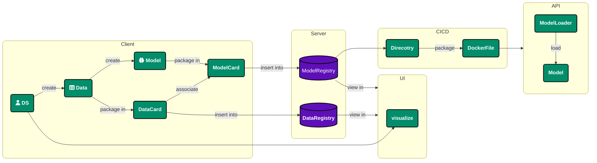

# Deployment

While `Opsml` is not an all-in-one platform that will deploy your model in one click (maybe one day :smile:), it does provide a helper class and a happy path to deploy your model. This is outlined below.

## Steps:

### DS Worflow

1. DS creates data and model
2. DS packages data and model into appropriate interfaces and `DataCard` and `ModelCard`, respectively.
3. `DataCard` and `ModelCard` are registered and pushed to their respective registries.

### CICD Workflow

1. During CICD, the model is downloaded from the `ModelRegistry` via the `Opsml CLI` to a directory
2. Model directory and API logic are packaged into a docker image

### API Workflow

1. Docker image is deployed to a server.
2. During startup, the API logic leverages the `ModelLoader` class to load the model from the directory.
3. Model is now ready to be used by the API.

::: opsml.model.ModelLoader
    options:
        show_root_heading: true
        show_source: true
        heading_level: 4