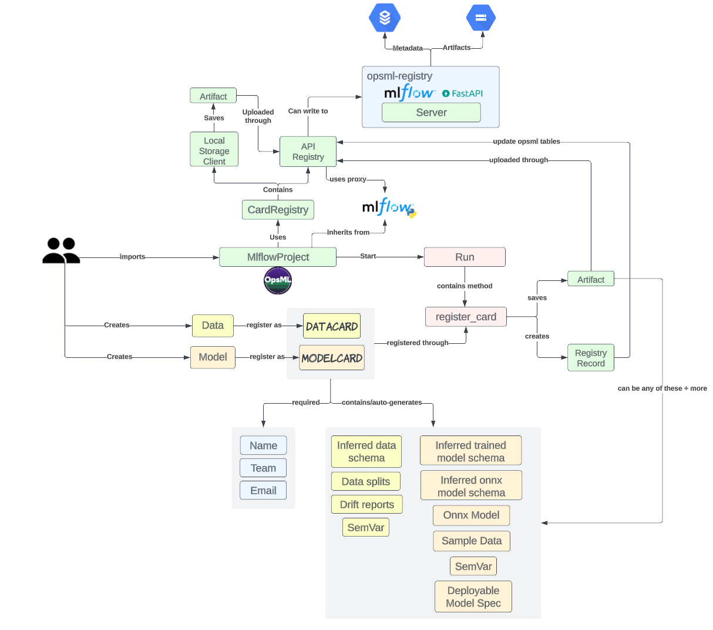

# `Opsml` Server Setup

In addition to using `Opsml` as a stand-alone python package, it can also be used as a server (`FastApi`) providing a proxy interface between data scientists and backend infrastructure. What this means for **data scientists**, is that they can use `Opsml` as they normally would without having to set any credentials apart from the http proxy uri. For **engineers**, this means that they can control the infrastucture, databases, and overall server setup based on their specifications and security requirements.

{ align=center }

## Setup
You can setup the `Opsml` server based on your team needs. For our purposes at `Shipt`, we tend to follow a conventional setup whereby we host Docker images via K8s. For this setup up, we typically will install `Opsml` and its dependencies into a Dockerfile and then at webserver runtime, we execute the following command:

-  `gunicorn -k uvicorn.workers.UvicornWorker --config=./app/gunicorn_conf.py --bind=0.0.0.0:3000 "opsml.app.main:run_app(run_mlflow=True, login=False)"`

- To use Mlflow with the `Opsml` server, you will also need to install the `Mlflow` extras (see [example_pyproject](example_toml.md))