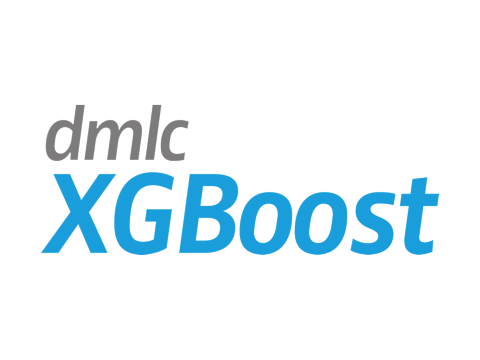

## Boost Examples

The following examples demonstrate how to use Opsml with LightGBM, XGBoost and CatBoost. All examples follow the same `pipeline` structure as the Sklearn examples.

### LightGBM

Includes examples of how to use Opsml with a LightGBM booster and sklearn api

- `lightgbm_boost.py` : Basic example of how to use Opsml with a LightGBM booster
- `lightgbm_sklearn.py` : Example of how to use Opsml with LightGBM sklean flavor

### XGBoost

Includes examples of how to use Opsml with a XGBoost model with the Sklearn API

### CatBoost

Includes examples of how to use Opsml with CatBoost