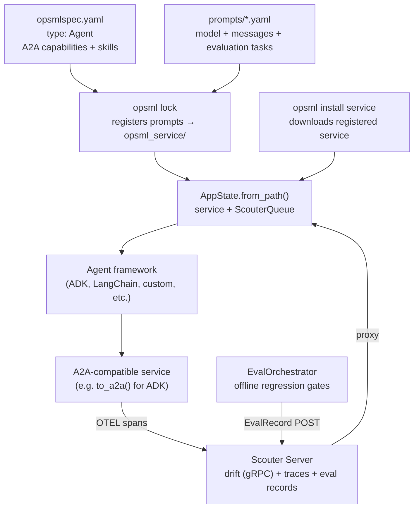
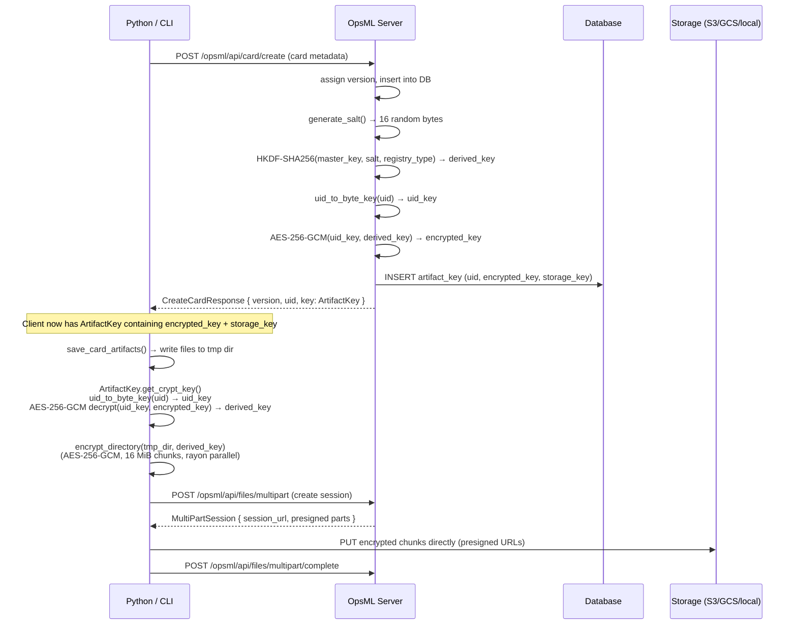
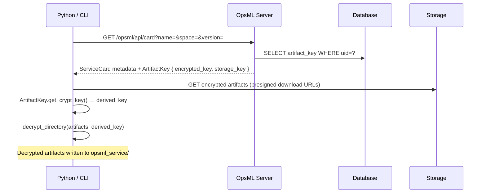
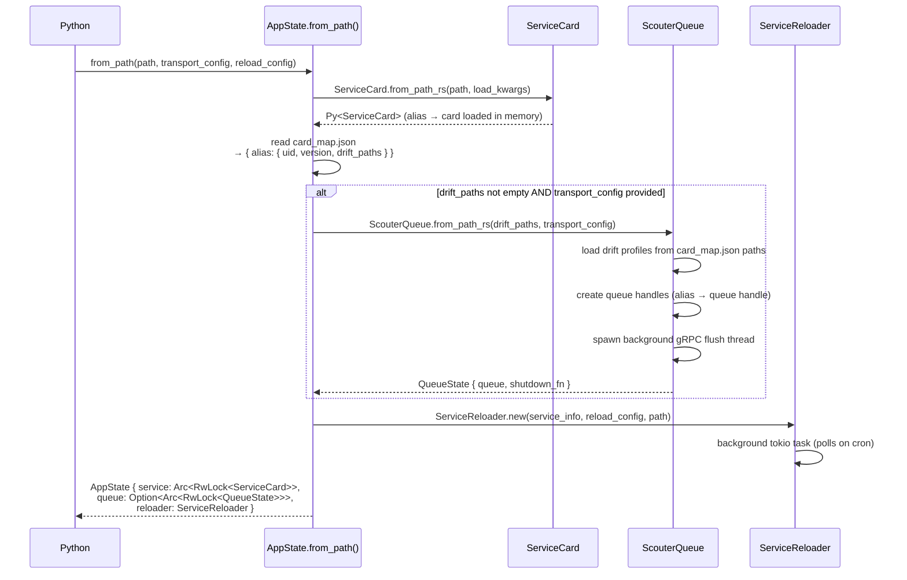
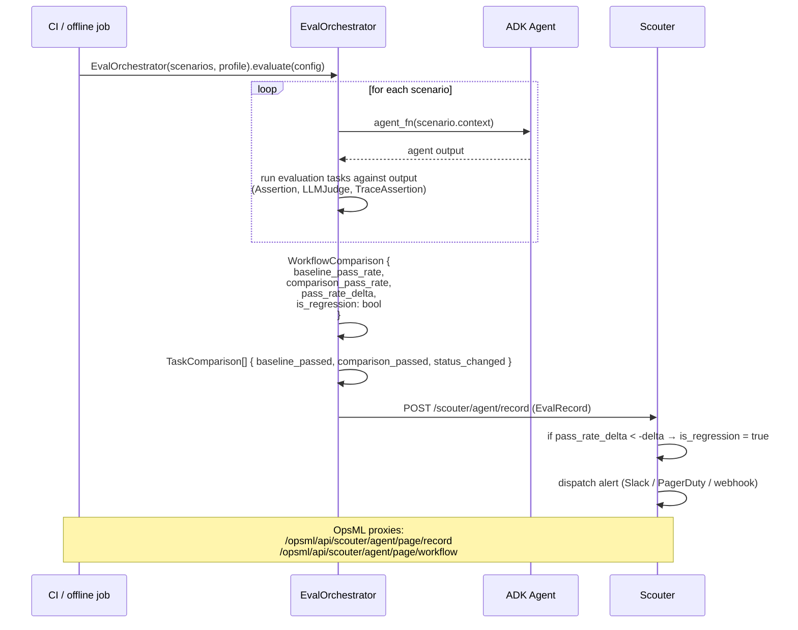
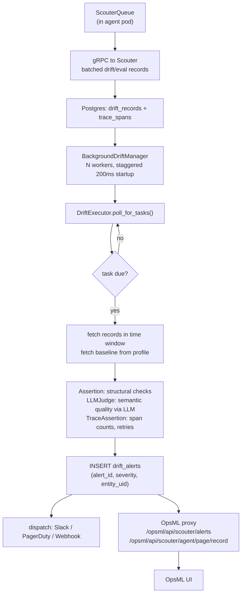

# Agent service architecture

OpsML's agent system is framework-agnostic. It provides versioned prompt storage, encrypted artifact management, A2A service registration, and evaluation via Scouter — regardless of whether your agent runs on Google ADK, LangChain, LlamaIndex, or something you built yourself. Your framework handles inference. OpsML handles everything that makes that inference reproducible and observable across environments.

The workflow is: define your agent service and prompts in YAML, run `opsml lock` to register them, load everything at runtime through `AppState`, and wire the loaded prompts into your agent framework of choice. Evaluations live in the prompt YAML files and run offline before deploy or online against production traffic.

---

## System overview



---

## Registration and artifact flow

This is the part most people get wrong, so it's worth being precise.

When `opsml lock` registers a prompt or service card, the **server generates the encryption key** and stores it. The **client does the encryption and upload** — the server never touches the raw artifact bytes.



The server derives the artifact encryption key (`derived_key`) via HKDF, then encrypts it with a key derived from the card's UID (`uid_key`). Only the ciphertext (`encrypted_key`) is stored in the database — never the plaintext `derived_key`. To decrypt artifacts, the client re-derives `uid_key` from the card UID (received in `CreateCardResponse`) and decrypts `encrypted_key` to recover `derived_key`.

The upload goes directly to the storage backend (S3, GCS, Azure, local) via presigned URLs from a multipart session. The server coordinates the session but does not proxy artifact bytes.

### Download (reverse flow)

On `opsml install service`, the client fetches the ArtifactKey from the server, gets presigned download URLs, downloads encrypted artifacts directly from storage, and decrypts locally:



The local `opsml_service/` directory always contains **decrypted** artifacts. Cloud storage always contains **encrypted** ones. If you delete `opsml_service/` and re-run `opsml install service`, you get the same decrypted artifacts back.

---

## Defining the agent service

### opsmlspec.yaml with type: Agent

The spec file declares two things: the cards (prompts) the service needs, and the A2A agent card that describes the service to the outside world.

```yaml
name: "my-agent"
space: "my-team"
type: Agent          # registers an A2A-compatible ServiceCard

metadata:
  description: "A recipe generation agent"
  language: "python"
  tags: ["agent", "recipe"]

service:
  # Cards loaded into AppState — paths resolve relative to this file
  cards:
    - alias: recipe_prompt
      path: "prompts/recipe.yaml"
      registry_type: prompt

    - alias: response_prompt
      path: "prompts/response_agent.yaml"
      registry_type: prompt

  # A2A agent card (protocol v0.3.0)
  agent:
    version: "0.3.0"
    capabilities:
      streaming: true
      push_notifications: false
      extended_agent_card: false
    default_input_modes: ["text/plain"]
    default_output_modes: ["text/plain"]
    description: "Generates recipes based on user preferences."
    name: "Recipe Agent"

    skills:
      - format: a2a
        id: "generate-recipe"
        name: "Generate Recipe"
        description: "Creates a complete recipe from a user request."
        input_modes: ["text/plain"]
        output_modes: ["text/plain", "text/markdown"]
        tags: ["recipe", "cooking"]
        examples:
          - "Make me a quick pasta for dinner"
          - "Suggest a vegan curry"

    supported_interfaces:
      - url: "http://localhost:8888"
        protocol_binding: "http"
        protocol_version: "0.3.0"

deploy:
  - environment: "development"
    urls: ["http://localhost:8888"]
    healthcheck: "/health"
```

`type: Agent` tells OpsML to generate an A2A agent card alongside the ServiceCard. The `service.agent` block is what gets embedded in that card — capabilities, skills, and supported interfaces follow the A2A 0.3.0 spec. The `service.cards` list is separate: those are the prompts your Python code loads at runtime.

Multi-agent services follow the same pattern. Just add more entries under `service.cards`:

```yaml
service:
  cards:
    - alias: orchestrator
      path: "prompts/orchestrator.yaml"
      registry_type: prompt
    - alias: meat_agent
      path: "prompts/meat_agent.yaml"
      registry_type: prompt
    - alias: vegan_agent
      path: "prompts/vegan_agent.yaml"
      registry_type: prompt
    - alias: dessert_agent
      path: "prompts/dessert_agent.yaml"
      registry_type: prompt
```

Each alias becomes a key in `AppState.service`.

---

## Defining prompts with evaluations

Prompts live in YAML files alongside the spec. The `evaluation` block in each file defines which tasks run against that prompt's outputs — both offline in CI and online via Scouter.

### Prompt YAML format

```yaml
space: my-team
name: recipe-prompt
prompt:
  model: gemini-2.5-flash
  provider: Google
  messages:
    - |
      Generate a complete recipe for: {user_request}
  system_instructions:
    - |
      You are an expert chef. Return vegetarian recipes only.
      Include: ingredients with quantities, step-by-step directions, prep time, servings.
  response_format:
    title: Recipe
    type: object
    properties:
      name:
        type: string
      ingredients:
        type: array
        items:
          type: object
          properties:
            name: { type: string }
            quantity: { type: string }
            unit: { type: string }
          required: [name, quantity, unit]
      directions:
        type: array
        items: { type: string }
      prep_time_minutes:
        type: integer
      servings:
        type: integer
    required: [name, ingredients, directions, prep_time_minutes, servings]
    additionalProperties: false

evaluation:
  alias: recipe_eval
  tasks:
    - task_type: Assertion
      id: has_ingredients
      context_path: recipe.ingredients
      operator: HasLengthGreaterThan
      expected_value: 0
      description: "Recipe contains at least one ingredient"
      depends_on: []
      condition: false

    - task_type: Assertion
      id: prep_time_under_limit
      context_path: recipe.prep_time_minutes
      operator: LessThan
      expected_value: 120
      description: "Prep time under 2 hours"
      depends_on: []
      condition: false
```

### LLM judge tasks

For semantic quality checks, point the task at a separate evaluation prompt:

```yaml
evaluation:
  alias: response_eval
  tasks:
    - task_type: LLMJudge
      id: relevance_score
      context_path: score
      operator: GreaterThanOrEqual
      expected_value: 3
      description: "Response scores 3+ on relevance"
      depends_on: []
      condition: false
      prompt:
        path: "prompts/evaluation/relevance.yaml"   # path to eval prompt
```

The eval prompt at `prompts/evaluation/relevance.yaml`:

```yaml
model: gemini-2.5-flash
provider: Gemini
messages:
  - |
    Evaluate this recipe response for relevance to the user request.
    User request: {user_request}
    Response: {response}

    Score 1-5. Return JSON: {"score": int, "reason": "string"}
response_format:
  title: EvaluationResponse
  type: object
  properties:
    score: { type: integer, minimum: 1, maximum: 5 }
    reason: { type: string }
  required: ["score", "reason"]
  additionalProperties: false
```

### Trace assertion tasks

For checking agent execution structure (retry counts, span names, tool calls):

```yaml
- task_type: TraceAssertion
  id: single_evaluation_call
  operator: Equals
  expected_value: 1
  description: "Evaluation ran exactly once (no excessive retries)"
  depends_on: []
  condition: false
  assertion:
    SpanCount:
      filter:
        ByName:
          name: recipe_evaluation   # span name emitted by the agent
```

### Conditional gates

Tasks with `condition: true` act as execution gates. If the gate fails, all tasks that `depends_on` it are skipped. This is useful for routing: check the output category first, then run expensive LLM judge tasks only for records that match.

```yaml
tasks:
  # Gate — free assertion, runs first
  - task_type: Assertion
    id: has_directions
    context_path: recipe.directions
    operator: HasLengthGreaterThan
    expected_value: 0
    condition: true          # if this fails, skip everything downstream
    depends_on: []

  # Only runs if has_directions passed
  - task_type: LLMJudge
    id: quality_score
    context_path: score
    operator: GreaterThanOrEqual
    expected_value: 3
    depends_on: [has_directions]
    prompt:
      path: "prompts/evaluation/quality.yaml"
```

---

## CLI workflow

### Lock: register and snapshot

```bash
opsml lock
```

This reads `opsmlspec.yaml`, registers each prompt as a `PromptCard` in the OpsML registry, and creates `opsml_service/` on disk:

```
your-agent/
├── opsmlspec.yaml
├── prompts/
│   ├── recipe.yaml
│   └── response_agent.yaml
└── opsml_service/             ← generated by opsml lock
    ├── card_map.json           ← alias → { uid, version, drift_paths }
    ├── recipe_prompt/          ← decrypted artifacts (local copy for AppState)
    └── response_prompt/
```

`opsml_service/` always contains **decrypted** artifacts. The encrypted copies live in your storage backend (S3/GCS/Azure/local). `AppState.from_path()` reads `card_map.json` to locate each card by alias and to know which Scouter drift profiles to register.

### Install: pull a registered service

To pull a service that was locked and registered on another machine (or by CI):

```bash
opsml install service
```

Run this from the directory containing `opsmlspec.yaml`. It resolves card versions from the registry, fetches each card's `ArtifactKey` from the server, downloads the encrypted artifacts directly from storage via presigned URLs, decrypts them locally, and writes the result to `opsml_service/`. After this, `AppState.from_path()` works the same as after a local `lock`.

---

## Runtime: loading the service

### AppState initialization



`service` and `queue` sit behind `Arc<RwLock<>>`. The reloader swaps them in-place when it detects a new version — no process restart needed.

```python
# lifespan.py
from pathlib import Path
from opsml.app import AppState

app = AppState.from_path(path=Path("opsml_service"))
```

`from_path()` loads the ServiceCard and all cards referenced in `card_map.json`. Each card is accessible by its alias. For prompt cards:

- `app.service["recipe_prompt"].prompt.model` — the model name (e.g. `"gemini-2.5-flash"`)
- `app.service["recipe_prompt"].prompt.system_instructions[0].text` — the system prompt text
- `app.service["recipe_prompt"].prompt.messages[0].text` — the first user message template

The accessed prompt fields are the same regardless of which framework consumes them. How you wire them in is up to you. Below is an example using Google ADK; swap in whichever framework you're using.

```python
# agent.py — Google ADK example
from google.adk.agents.llm_agent import Agent
from google.adk.a2a.utils.agent_to_a2a import to_a2a
from starlette.responses import JSONResponse
from .lifespan import app

root_agent = Agent(
    model=app.service["recipe_prompt"].prompt.model,
    name="recipe_agent",
    description="Generates vegetarian recipes from user requests.",
    instruction=app.service["recipe_prompt"].prompt.system_instructions[0].text,
)

# to_a2a() wraps the agent in an A2A-compatible Starlette app.
# The agent card at /.well-known/agent.json comes from the ServiceCard
# registered in OpsML — the service.agent block in opsmlspec.yaml.
a2a_app = to_a2a(root_agent, host="localhost", port=8888, protocol="http")

@a2a_app.route("/health", methods=["GET"])
async def health_check(request):
    return JSONResponse({"status": "healthy"})
```

### Multi-agent example (Google ADK)

For orchestrated pipelines, each sub-agent maps to its own prompt alias in `AppState`. This is Google ADK-specific syntax; the `app.service[alias]` access pattern is identical in any framework.

```python
from google.adk.agents.llm_agent import Agent
from .lifespan import app

meat_agent = Agent(
    model=app.service["meat_agent"].prompt.model,
    name="meat_agent",
    instruction=app.service["meat_agent"].prompt.messages[0].text,
    output_key="meat_recipe",
)

vegan_agent = Agent(
    model=app.service["vegan_agent"].prompt.model,
    name="vegan_agent",
    instruction=app.service["vegan_agent"].prompt.messages[0].text,
    output_key="vegan_recipe",
)

orchestrator = Agent(
    model=app.service["orchestrator"].prompt.model,
    name="orchestrator",
    instruction=app.service["orchestrator"].prompt.messages[0].text,
    sub_agents=[meat_agent, vegan_agent],
)
```

Most agent frameworks expose lifecycle hooks. In ADK these are callbacks (`before_model_callback`, `after_model_callback`). In other frameworks the names differ but the intent is the same: intercept model calls to add context, log inputs, or feed evaluation records into Scouter. The Scouter tracing code below applies regardless of framework — it's just Python and OTEL.

---

## Offline evaluation



Evaluations run offline against a fixed scenario set before you deploy. The tasks defined in each prompt's `evaluation` block are the same ones that run online.

```python
from scouter.evaluate import EvalOrchestrator, Scenario, EvalConfig

# Each scenario is one agent call + expected context
scenarios = [
    Scenario(
        context={"user_request": "Quick pasta for dinner"},
        agent_fn=lambda ctx: root_agent.run(ctx["user_request"]),
    ),
    Scenario(
        context={"user_request": "Spicy lentil soup"},
        agent_fn=lambda ctx: root_agent.run(ctx["user_request"]),
    ),
]

# Tasks come from the prompt card's evaluation block
orchestrator = EvalOrchestrator(
    scenarios=scenarios,
    profile=app.service["recipe_prompt"].eval_profile["recipe_eval"],
)

results = orchestrator.evaluate(EvalConfig(sample_ratio=1.0))
results.as_table()
```

### Using it as a CI gate

```python
results = orchestrator.evaluate(EvalConfig(sample_ratio=1.0))

# Fail the pipeline if pass rate drops below threshold
if results.metrics.pass_rate < 0.85:
    raise SystemExit(f"Eval failed: pass rate {results.metrics.pass_rate:.0%} < 85%")
```

`WorkflowComparison` compares two runs and flags regressions:

```python
baseline = orchestrator.evaluate(baseline_config)
candidate = orchestrator.evaluate(candidate_config)

comparison = baseline.compare(candidate)
# comparison.is_regression → True if pass_rate_delta < -delta_threshold
# comparison.task_comparisons → per-task pass/fail changes
```

Results are posted to Scouter via `POST /scouter/agent/record`. OpsML proxies queries to those records through `/opsml/api/scouter/agent/page/record` and `/opsml/api/scouter/agent/page/workflow`.

---

## Online evaluation and tracing



Enable OTEL tracing by calling `instrument()` on your `AppState`. It patches the service UID into every span automatically so trace queries are scoped to the deployed version:

```python
from opsml.scouter import GrpcConfig

app.instrument(
    transport_config=GrpcConfig(host="scouter", port=4317),
    sample_ratio=0.1,    # trace 10% of requests
)
```

Spans go to Scouter's trace endpoint. The same evaluation tasks defined in your prompt YAML run asynchronously on sampled spans — no separate configuration needed for online eval. When a `TraceAssertion` task finds a span pattern violation, it generates an `EvalRecord` and the alert pipeline fires.

Evaluation profiles are registered during `register_card` (in `opsml lock`), not at runtime. At runtime, your agent feeds `EvalRecord` entries into Scouter via the active OTEL span. You do this inside whatever lifecycle hook your framework provides — a callback, middleware, or post-processing step. Below is a Google ADK example using `after_model_callback`, which runs after every model call and has access to the raw `LlmResponse`:

```python
from opentelemetry import trace
from opsml.scouter.tracing import ActiveSpan
from opsml.scouter.evaluate import EvalRecord
from typing import cast

# Google ADK example — adapt the signature to your framework's hook API
def after_model_callback(callback_context, llm_response):
    tracer = trace.get_tracer("response_callback")
    with cast(ActiveSpan, tracer.start_as_current_span("response_evaluation")) as span:
        content = llm_response.content
        if content and content.parts:
            span.add_queue_item(
                "response_eval",
                EvalRecord(
                    context={"response": content.parts[0].text},
                    session_id=callback_context.session.id,
                ),
            )
        else:
            span.set_status("ERROR", "No content in LLM response or content has no parts")
    return None

# Wire the callback into the ADK agent
root_agent = Agent(
    model=app.service["recipe_prompt"].prompt.model,
    name="recipe_agent",
    instruction=app.service["recipe_prompt"].prompt.system_instructions[0].text,
    after_model_callback=after_model_callback,
)
```

`span.add_queue_item()` is non-blocking — it enqueues the `EvalRecord` to the background gRPC flush thread. The `"response_eval"` key maps to the evaluation profile alias registered on the `PromptCard`. When the pass rate for that alias drops below the configured threshold, Scouter dispatches the configured alert (Slack, PagerDuty, webhook).

---

## Hot reload

`AppState` supports zero-downtime reload when a new service version is registered:

```python
from opsml.app import ReloadConfig

app = AppState.from_path(
    path=Path("opsml_service"),
    reload_config=ReloadConfig(cron="0 */6 * * *"),  # check every 6 hours
)
app.start_reloader()
```

Two background tasks run after `start_reloader()`:

1. A download task polls OpsML on the cron schedule and fetches new artifacts to a staging directory.
2. A reload task swaps `service` and `ScouterQueue` in-place (via `Arc<RwLock<>>`) when the download completes.

The swap is atomic from the handler's perspective. Inflight requests finish on the old version; new requests pick up the new one. No restart, no dropped connections.

---

## Authentication and token exchange

OpsML issues a JWT on login. Every protected route carries `Extension(perms): Extension<UserPermissions>`, populated by `auth_api_middleware` before the handler runs.

Scouter access uses token exchange — `exchange_token_from_perms()` converts the OpsML JWT into a Scouter-compatible token. Both systems share the same space-based permission model (read / write / admin per space), so OpsML permissions apply transparently to Scouter queries proxied through OpsML.

```
User → POST /opsml/api/auth/login → JWT
JWT → auth_api_middleware → UserPermissions { space: "my-team", role: "write" }
Handler needs Scouter → exchange_token_from_perms(perms) → scouter_token
scouter_token → POST /scouter/drift/psi (proxied by OpsML server)
Scouter validates token → checks space permissions → returns data
```

No separate Scouter login. The token exchange is one-way and happens per-request inside the OpsML handler.
