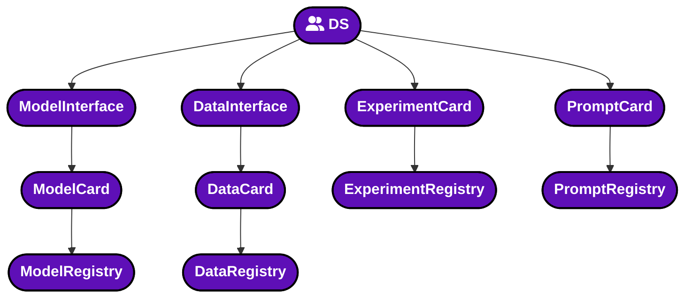

Cards are one of the primary data structures of opsml. All cards store specific information depending on their type and are serialized and stored in a registry and backend storage system




## Card Types

- **DataCard**: Card used to store data-related information. DataCards require an interface and currently support (pandas)[], (numpy)[], (arrow)[], (polars)[], (numpy)[], (torch)[], (sql)[] and (custom)[] interfaces.
- **ModelCard**: Card used to store model-related information. ModelCards require an interface and currently support (huggingface)[], (lightgbm)[], (lightning)[], (sklearn)[], (tensorflow)[], (torch)[], (xgboost)[], (catboost)[] and (custom)[] interfaces.
- **ExperimentCard**: Card used to store experiment-related information (metrics, parameters, cards, hardware metrics). ExperimentCards are typically used in as a context manager via `with start_experiment()`.
- **PromptCard**: Card used to store prompt-related information for GenAI workflows.

### Card Arguments

All cards require set of arguments in order to be registered. This is to ensure the card is properly assigned ownership and can be tracked. The arguments are:

- **space**: The space associated with the card. This is typically the name of the organization or team that owns the card.
- **name**: The name of the card. This is typically a short, descriptive name that identifies the card.
  
### Naming

All cards follow a standardized naming conventions of `{space}/{name}/v{version"}`. This is to ensure that cards are easily 

!!!note
    These arguments can also be be supplied through a pyproject.toml tool configuration. See the [tools](../tools.md) section for more information.

## Registries

Each card type is associated with a specific registry (modelcard with model registry, promptcard with prompt registry). Registries are accessible via the `CardRegistry` class and are used to register, list, load, update and delete cards. To access a specific registry, you can pass the string name of the registry or the `RegistryType` enum. The available registries are:

**ModelRegistry**:

```python
from opsml import CardRegistry, RegistryType

model_registry = CardRegistry(registry_name="model")
model_registry = CardRegistry(registry_name=RegistryType.Model)
```

**DataRegistry**:

```python
from opsml import CardRegistry, RegistryType
data_registry = CardRegistry(registry_name="data")
data_registry = CardRegistry(registry_name=RegistryType.Data)
```

**ExperimentRegistry**:

```python
from opsml import CardRegistry, RegistryType
experiment_registry = CardRegistry(registry_name="experiment")
experiment_registry = CardRegistry(registry_name=RegistryType.Experiment)
```

**PromptRegistry**:

```python
from opsml import CardRegistry, RegistryType
prompt_registry = CardRegistry(registry_name="prompt")
prompt_registry = CardRegistry(registry_name=RegistryType.Prompt)
```

**All Registries**:

```python
from opsml import CardRegistries

registries = CardRegistries()
# access specific registry (registries.model, registries.data, registries.experiment, registries.prompt)
```

### Listing Cards

You can list cards in a registry using the `list_cards` method. This will return a list of cards containing the card information. You can filter the results by name, space, version and uid. 


Returns a list of cards. 
: Required Args:
  
    - space: space associated with card *(Optional)*
    - name: Name of card *(Optional)*
    - version: Version of Card *(Optional)*
    - uid: Uid of card *(Optional)*
    - max_date: Maximum date of card *(Optional)*
    - tags: Tags associated with card *(Optional)*
    - sort_by_timestamp: Sort by timestamp *(Optional)*
    - limit: Limit the number of cards returned *(Optional)*

  Example:

  ```python

  from opsml import CardRegistry, RegistryType

  registry = CardRegistry(RegistryType.Model) # can be "data", "model", "run", "pipeline

  # examples
  registry.list_cards() 
  # will list all cards in registry

  registry.list_cards(limit=10) 
  # will list cards and limit the result to 10
  
  registry.list_cards(name="linear-reg")
    # list all cards with name "linear-reg"
  
  registry.list_cards(space="opsml", name="linear-reg") 
  # list all cards with name "linear-reg" with space "opsml"
  
  registry.list_cards(space="opsml", name="linear-reg", version="1.0.0") 
  # list card with name "linear-reg" with space "opsml" and version 1.0.0

  registry.list_cards(space="opsml", name="linear-reg", version="1.*") 
  # list cards with name "linear-reg" with space "opsml" and major version of "1"

  registry.list_cards(space="opsml", name="linear-reg", version="^2.3.4") 
  # list card with name "linear-reg" with space "opsml" and latest version < 3.0.0

  registry.list_cards(space="opsml", name="linear-reg", version="~2.3.4") 
  # list card with name "linear-reg" with space "opsml" and latest version < 2.4.0

  registry.list_cards(uid=uid)
  # list card by uid
  ```

### Registering a Card
Register a card to a registry 
: Required Args:
  
    - card: Card to register
    - version_type: Type of version increment. Must be of type `VersionType` (VersionType.Major, VersionType.Minor, VersionType.Patch, VersionType.PreRelease, VersionType.Build)
    - registry_name: Name of registry to register to *(Optional)*
    - save_path: Specific path to save to in root opsml folder if default are not preferred *(Optional)*


Example:

```python

from opsml import CardRegistry

model_registry = CardRegistry("model")

# skipping ModelInterface logic
...

model_card = ModelCard(
      interface=model_interface,
      space="opsml",
      name="linear-reg",
  )

example_record = model_registry.register_card(card=model_card)
print(model_card.version)
#> 1.0.0
  
```

### Loading Cards
Load an Artifact card from a registry. 
: Required Args:

    - space: space associated with card *(Optional)*
    - name: Name of card *(Optional)*
    - version: Version of Card *(Optional)*
    - uid: Uid of card *(Optional)*
    - interface: Interface of card *(Optional)*
  
  Either uid or name and space must be provided. If both are provided, uid will be used.
  If you are loading a card that has a custom interface, you must provide the interface as well.

Example:

```python
from opsml import CardRegistry
model_registry = CardRegistry("model")

model_card = model_registry.load_card(
    space="opsml",
    name="linear-reg",
    version="1.0.0",
  )
print(model_card.version)
#> 1.0.0
```

### Update Cards
Update a card from a registry. 
: Required Args:
    - card: Card to update
  
!!!warning
    Updating a card is not recommended. It breaks the idea of versions and immutability of versions. It is recommended to create a new version of the card instead.

!!!note  
    The card must be loaded from the registry before it can be updated.

```python
from opsml import CardRegistry
model_registry = CardRegistry("model")

# skipping card logic
...

card.name = "linear-reg-change"
model_registry.update_card(card)
```


### Deleting Cards
Delete a card from a registry.
: Required Args:
    - card: Card to delete

```python
from opsml import CardRegistry
model_registry = CardRegistry("model")

# skipping card logic
...

model_registry.delete_card(card)
```

