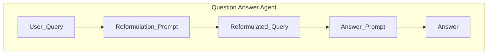

## LLM Evaluation

Opsml provides you with tools to run offline LLM evaluations. This is is often useful for when you (1) want to compare and benchmark various prompts, and (2) you want to evaluate different versions of prompts and LLM services that you may already be using in production.

**Note**: You can run an LLM evaluation by importing the `evaluate_llm` function directly from opsml.evaluate or you can create an evaluation as part of an experiment `exp.llm.evaluate(...)`. The latter is useful if you want to track and version your evaluations as part of an experiment.

## Getting Started

To run and LLM evaluation, you will first need to obtain your evaluation data and construct a list of `LLMEvalRecord` instances. Each `LLMEvalRecord` represents a single evaluation instance, containing the metadata you wish to evaluate. Note, we have left this intentionally flexible so that you can evaluate any type of metadata you wish.

### Example: Evaluating a Prompt for Query Reformulation

#### Step 1: Example Workflow Setup

Let's say you have a use case where you want to evaluate how well a prompt reformulates user search queries and how relevant the answers are to the original user query. The prompts used for this task are shown below and does the following things:

- Takes a bound parameter `${user_query}` which is the original user search query.
- Reformulates the query to be more feature-rich and keyword-dense, while preserving the original
- Takes the `${reformulated_query}` and injects it into an answer prompt to get an answer.

```python
reformulation_prompt = Prompt(
    message=(
        "You are an expert at query reformulation. Your task is to take a user's original search query "
        "and rewrite it to be more feature-rich and keyword-dense, so it better aligns with the user's intent "
        "and improves search results.\n\n"
        "Guidelines:\n"
        "- Expand abbreviations and clarify ambiguous terms.\n"
        "- Add relevant synonyms, related concepts, and specific features.\n"
        "- Preserve the original intent, but make the query more explicit and comprehensive.\n"
        "- Do not change the meaning of the query.\n"
        "- Return only the reformulated query.\n\n"
        "User Query:\n"
        "${user_query}\n\n"
        "Reformulated Query:"
    ),
    model="gemini-2.5-flash-lite",
    provider="gemini",
    model_settings=GeminiSettings(
        generation_config=GenerationConfig(
            thinking_config=ThinkingConfig(thinking_budget=0),
        ),
    ),
)

answer_prompt = Prompt(
    message=("You are a helpful assistant that can answer any question!" 
             "Please provide an answer to the following user query.\n\n"
             "Question:\n"
             "${reformulated_query}\n\n"
             "Answer:"
            ),
    model="gemini-2.5-flash-lite",
    provider="gemini",
)
```
The overall flow for using the prompt would look like the following:



#### Step 2: Create an `LLMEvalMetric` to Evaluate the Prompt

Now say you want to (1) evaluate how well the prompt reformulates user queries into better-structured queries and (2) how relevant the provided answer is to the user input. In this scenario, imagine you already have a dataset of user queries, their reformulated queries and the returned answers (this could be from an experiment you ran in production). Now, to evaluate the prompts and Agent, you would create a list of `LLMEvalRecords` containing the `user_query`, `reformulated_query` and `answer` context as well as an `LLMEvalMetric` that defines how you want to evaluate the prompt using an `LLM as a judge` workflow.

```python
from opsml.genai import Prompt, Score
from opsml.evaluate import LLMEvalMetric, LLMEvalRecord, evaluate_llm

reformulation_eval_prompt = Prompt(
    message=(
        "You are an expert evaluator of search query relevance. \n"
        "You will be given a user query and its reformulated version. \n"
        "You task is to assess how relevant the reformulated query is to the information needs of the user. \n"
        "Consider the following criteria:\n"
        "- Does the query contain relevant keywords and concepts?\n"
        "- Is the query clear and unambiguous?\n"
        "- Does the query adequately express the user's intent?\n\n"
        "Provide your evaluation as a JSON object with the following attributes:\n"
        "- score: An integer from 1 (poor) to 5 (excellent) indicating the overall reformulation score.\n"
        "- reason: A brief explanation for your score.\n\n"
        "Format your response as:\n"
        "{\n"
        '  "score": <integer 1-5>,\n'
        '  "reason": "<your explanation>"\n'
        "}\n\n"
        "User Query:\n"
        "${user_query}\n\n" #(1)
        "Reformulated Query:\n"
        "${reformulated_query}\n\n" #(2)
        "Evaluation:"
    ),
    model="gemini-2.5-flash-lite-preview-06-17",
    provider="gemini",
    response_format=Score, #(3)
)

answer_eval_prompt = Prompt(
    message=(
        "You are an expert evaluator of answer relevance. \n"
        "You will be given a user query and an answer generated from a reformulated version of that query. \n"
        "Your task is to assess how relevant and accurate the answer is in addressing the user's original information needs. \n"
        "Consider the following criteria:\n"
        "- Does the answer directly address the user's query?\n"
        "- Is the information provided accurate and reliable?\n"
        "- Is the answer clear, concise, and well-structured?\n\n"
        "Provide your evaluation as a JSON object with the following attributes:\n"
        "- score: An integer from 1 (poor) to 5 (excellent) indicating the overall answer quality score.\n"
        "- reason: A brief explanation for your score.\n\n"
        "Format your response as:\n"
        "{\n"
        '  "score": <integer 1-5>,\n'
        '  "reason": "<your explanation>"\n'
        "}\n\n"
        "User Query:\n"
        "${user_query}\n\n" #(1)
        "Answer:\n"
        "${answer}\n\n" #(2)
        "Evaluation:"
    ),
    model="gemini-2.5-flash-lite-preview-06-17",
    provider="gemini",
    response_format=Score, #(3)
)

eval_metrics = [
    LLMEvalMetric(
        name="reformulation_quality",
        prompt=reformulation_eval_prompt,
    ),
    LLMEvalMetric(
        name="answer_relevance",
        prompt=answer_eval_prompt,
    )
]

flight_record = LLMEvalRecord(
    context={
        "user_query": "cheap flights to Europe next month",
        "reformulated_query": "affordable airfare to Europe next month",
        "answer": "I found several options for cheap flights to Europe next month."
    },
    id="record_1",
)

technical_record = LLMEvalRecord(
    context={
        "user_query": "why won't my laptop turn on",
        "reformulated_query": "laptop computer won't boot power issues troubleshooting steps hardware failure battery power supply diagnostic repair",
        "answer": "If your laptop won't turn on, try these troubleshooting steps: 1) Check power connections - ensure the charger is plugged in securely and the power outlet works. 2) Remove the battery (if removable) and hold the power button for 30 seconds, then reconnect and try again. 3) Look for LED indicators on the laptop or charger. 4) Try a different power adapter if available. 5) Check for physical damage to ports or cables. 6) If these steps don't work, the issue may be hardware-related (motherboard, RAM, or hard drive failure) requiring professional repair"
    },
    id="record_2",
)

cooking_record = LLMEvalRecord(
    context={
        "user_query": "easy dinner recipes with chicken",
        "reformulated_query": "simple quick chicken dinner recipes healthy family-friendly weeknight meals",
        "answer": "Here are some easy chicken dinner recipes: 1) Baked Lemon Garlic Chicken - Marinate chicken breasts in lemon juice, garlic, olive oil, and herbs, then bake until cooked through. 2) One-Pan Chicken and Veggies - Sauté chicken pieces with mixed vegetables in a skillet with olive oil and your favorite seasonings. 3) Chicken Stir-Fry - Cook sliced chicken with colorful veggies in a wok or large pan, adding soy sauce and ginger for flavor. 4) Chicken Tacos - Season shredded chicken with taco seasoning and serve in tortillas with your favorite toppings. 5) Chicken Alfredo Pasta - Toss cooked pasta with grilled chicken and a creamy Alfredo sauce for a quick and satisfying meal."
    },
    id="record_3",
)

records = [flight_record, technical_record, cooking_record]

results = evaluate_llm(
    records=records,
    metrics=eval_metrics,
)
```

1. `${user_query}` is a bound parameter that will be populated from the `LLMEvalRecord` context
2. `${reformulated_query}` is a bound parameter that will be populated from the `LLMEvalRecord` context
3. `LLMEvalMetrics` currently require all prompts to return a `Score` object. This is critical as the score object allows us to extract a numerical score for evaluation.

##### Eval Metric Flow

As you can see from the above example, the overall flow for evaluating an LLM using `LLMEvalMetric` is as follows:

1. Define the evaluation metrics using `LLMEvalMetric`, providing the necessary prompts for each metric.
2. Create `LLMEvalRecord` instances for each record you want to evaluate, populating the context with the relevant information that will be injected into the prompts.
3. Call the `evaluate_llm` function with the records and metrics to obtain the evaluation results.

<h1 align="center">
  <br>
  
  <br>
</h1>

#### Step 3: Evaluation Configuration

By default, the above `evaulate_llm` function will execute without any additional configuration. It will extract the defined metric prompts, bind the context variables from each record, and execute the prompts against the defined LLM provider and model and then extract the scores. However, if you want a more robust evaluation, we recommend you provide an `EvaluationConfig` configured to your needs.

EvaluationConfig allows you to customize the evaluation process in several ways:

- Specify which fields from the `LLMEvalRecord` context should be embedded. These embedding will be used to calculate means and similarity scores.
- Indicate whether you want to compute similarity scores between the embedded fields.
- Enable clustering to identify patterns in the evaluation results.
- Enable histogram computations to generate histograms for all numerical fields.

[EvaluationConfig documentation](/opsml/docs/api/evaluate#opsml._evaluate.EvaluationConfig)

```python
from opsml.evaluate import EvaluationConfig
from opsml.genai.openai import OpenAIEmbeddingConfig
from opsml.genai import Embedder, Provider

#(previous code)...

embedder = Embedder( #(1)
    Provider.OpenAI,
    config=OpenAIEmbeddingConfig(
        model="text-embedding-3-small",
        dimensions=512,
    ),
)

results = evaluate_llm(
    records=records,
    metrics=eval_metrics,
    config=EvaluationConfig( #(2)
        embedder=embedder,
        embedding_targets=["user_query", "answer"], #(3)
        compute_similarity=True, #(4)
        cluster=True, #(5)
        compute_histograms=True, #(6)
    ),
)
```

1. Create an `Embedder` instance to generate embeddings for the evaluation records. This is useful for similarity computations and clustering. Here, we are using OpenAI's embedding model.
2. Pass an `EvaluationConfig` instance to the `evaluate_llm` function to customize the evaluation process.
3. Specify which fields from the `LLMEvalRecord` context should be embedded. In this case, we are embedding both the `user_query` and `answer`. These embedding will be used to calculate means and similarity scores.
4. Indicate that we want to compute similarity scores between the embedded fields.
5. If clustering is enabled, Scouter will execute a dbscan with all numerical values (scores, similarity scores, embeddings etc.) to identify clusters of similar records. This can help identify patterns in the evaluation results
6. Enable histogram computations to generate histograms for all numerical fields

#### Step 4: Analyzing the Results

The results object (`LLMEvalResults`) returned from the `evaluate_llm` function contains a wealth of information about the evaluation. You can access individual record results, overall metrics, and any errors that occurred during the evaluation process.

```python

# Assess individual record results
results = evaluate_llm(...)


record1_metrics = results["record_1"].metric
print(f"Record 1 Reformulation Quality Score: {record1_metrics['reformulation_quality'].score}")
print(f"Record 1 Reformulation Quality Reason: {record1_metrics['reformulation_quality'].reason}")

print(f"Record 1 Answer Relevance Score: {record1_metrics['answer_relevance'].score}")
print(f"Record 1 Answer Relevance Reason: {record1_metrics['answer_relevance'].reason}")

# Create a dataframe for easier analysis
df = results.to_dataframe() # pandas
print(df.head())

df = results.to_dataframe(polars=True) # polars
print(df.head())

# Access histograms
histograms = results.histograms
for field, histogram in histograms.items():
    print(f"Histogram for {field}: {histogram}")
```

Please refer to the [LLMEvalResults documentation](/opsml/docs/api/evaluate#opsml._evaluate.LLMEvalResults) for more details on how to work with the results object.
