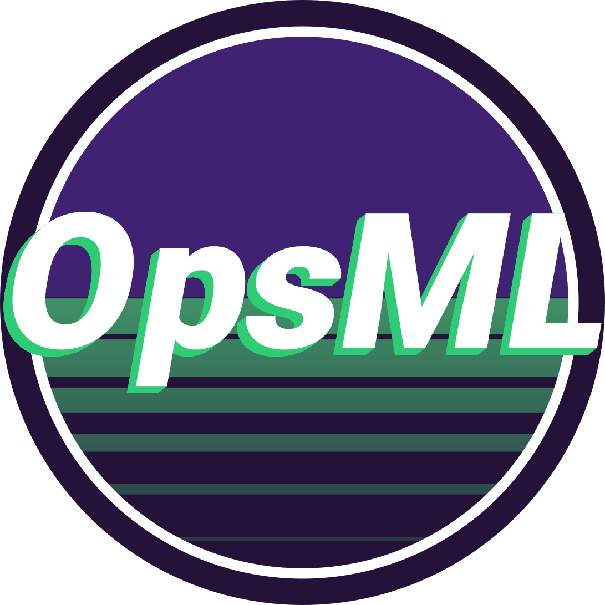

<h1 align="center">
  <br>
  
  <br>
</h1>

<h3 align="center">End-to-End AI Lifecycle Management</h3>
---

[](https://github.com/demml/opsml/actions/workflows/lints-test.yml)
[](https://github.com/zricethezav/gitleaks-action)
[](https://opensource.org/licenses/MIT)


OpsML is an AI lifecycle management platform built for the governance of both traditional ML and agentic AI systems. Its central abstraction is the **card** — a versioned, encrypted, registry-tracked record that wraps data, models, experiments, prompts, agents, or services. Cards are created in Python or YAML, persisted to a Rust server, and visualized in a SvelteKit UI.

Teams use OpsML to bring structure and governance to AI systems: consistent versioning, artifact lineage, monitoring, and observability — from initial training through production deployment.

## Highlights

- <span class="text-alert">**Artifact-First**</span>: Every artifact — datasets, models, prompts, agents, services — is a versioned card tracked in a registry with full lineage.
- <span class="text-alert">**Traditional ML + Agentic AI**</span>: One platform covers the full spectrum: model training workflows, prompt versioning, agent governance, and service deployments — all under a single dependency.
- <span class="text-alert">**Rust Core, Python Stubs**</span>: All logic — client, server, storage, auth, encryption, versioning — is implemented in Rust. The Python layer is top-level stubs only (PyO3/maturin). No business logic lives in Python.
- <span class="text-alert">**Monitoring & Observability**</span>: Drift detection, data profiling, GenAI evaluations, and OpenTelemetry trace ingestion — available across the platform when integrated with [Scouter](https://github.com/demml/scouter).
- <span class="text-alert">**No Hidden Magic**</span>: Abstractions are thin and documented. You can read the code and understand exactly what's happening.

## v3.0.0 Release

v3.0.0 is generally available and ready for use in existing ML workflows.

**Stable** — no breaking changes planned:

| Component | Status |
|---|---|
| `DataCard` | Stable |
| `ModelCard` | Stable |
| `ExperimentCard` | Stable |

*Anything ported from OpsML v2 is considered stable unless explicitly marked as beta.* Let us know if you encounter any issues

**Beta** — breaking changes possible in versions before 3.1.0:

| Component | Status |
|---|---|
| `PromptCard` | Beta |
| `ServiceCard` / `AgentCard` | Beta |
| Agent UI | Beta |
| Prompt UI | Beta |
| Observability UI | Beta |

If you depend on beta components, pin to a specific version and review the changelog before upgrading to any release before 3.1.0. Share feedback via [GitHub Issues](https://github.com/demml/opsml/issues).

## See it in Action

### Traditional ML

```python title="ML Workflow Quickstart"
from opsml.helpers.data import create_fake_data
from opsml import SklearnModel, CardRegistry, TaskType, ModelCard

X, y = create_fake_data(n_samples=1200)

from sklearn import ensemble
classifier = ensemble.RandomForestClassifier(n_estimators=5)
classifier.fit(X.to_numpy(), y.to_numpy().ravel())

model_interface = SklearnModel(  # (1)
    model=classifier,
    sample_data=X[0:10],
    task_type=TaskType.Classification,
)
model_interface.create_drift_profile(alias="drift", data=X) # (2)

card = ModelCard(
    interface=model_interface,
    space="opsml",
    name="my_model",
)
CardRegistry("model").register_card(card)

print(card.version)   # e.g., "1.0.0"
print(card.uid)       # e.g., "01962a48-e0cc-7961-9969-8b75eac4b0de"
```

1.  `SklearnModel` is one of several model interfaces. Others include `XGBoostModel`, `LightGBMModel`, `TorchModel`, and `HuggingFaceModel`.
2.  OpsML integrates with [Scouter](https://github.com/demml/scouter) for drift detection, data profiling, and observability.


### GenAI — Prompts

```python title="GenAI - OpenAI"
from openai import OpenAI
from opsml import PromptCard, Prompt, CardRegistry

client = OpenAI()

card = PromptCard(
    space="opsml",
    name="my_prompt",
    prompt=Prompt(
        model="gpt-4o",
        provider="openai",
        messages="Provide a brief summary of the programming language ${language}.", # (1)
        system_instructions="Be concise, reply with one sentence.",
    ),
)

def chat_app(language: str):
    user_message = card.prompt.bind(language=language).messages[0]
    system_instruction = card.prompt.system_instructions[0]

    response = client.chat.completions.create(
        model=card.prompt.model,
        messages=[
          system_instruction.model_dump(),
          user_message.model_dump()
        ]
    )
    return response.choices[0].message.content

if __name__ == "__main__":
    result = chat_app("Python")
    print(result)

    registry = CardRegistry("prompt") # (2)
    registry.register_card(card)
```

1.  `${language}` is a template variable — call `card.prompt.bind(language="Python")` to substitute it at runtime.
2.  `CardRegistry` accepts a string (`"prompt"`) or `RegistryType.Prompt`.


### Agentic Workflow

Prompts registered in OpsML work directly with agent frameworks. The `PromptCard` provides the model identifier and messages your agent framework expects:

```python title="Agent - PydanticAI"
from pydantic_ai import Agent
from opsml import CardRegistry

# Load a versioned prompt from the registry
card = CardRegistry("prompt").load_card(space="opsml", name="my_prompt")

agent = Agent(
    card.prompt.model_identifier,
    system_instruction=card.prompt.system_instructions[0].text,
)

result = agent.run_sync(card.prompt.messages[0].text)
print(result.output)
```

### Agent Registry *(beta)*

Agents are most commonly defined via an `opsmlspec.yaml` file and managed through the CLI. The YAML spec describes the agent's capabilities, skills, interfaces, and linked cards. The CLI resolves versions and installs artifacts.

```yaml title="opsmlspec.yaml"
name: support-agent
space: platform-team
type: Agent

metadata:
  description: "Customer support agent for billing and account queries."
  tags: ["support", "billing"]

service:
  version: "1.0.0"
  write_dir: opsml_service
  cards:
    - alias: support-prompt
      space: platform-team
      name: support-prompt
      version: "1.*"
      type: prompt

  agent:
    name: support-agent
    description: "Customer support agent for billing and account queries."
    version: "1.0.0"
    capabilities:
      streaming: true
    supported_interfaces:
      - url: "https://agents.example.com/support/v1"
        protocol_binding: "HTTP+JSON"
    default_input_modes: ["text"]
    default_output_modes: ["text"]
    skills:
      - id: billing-query
        name: "Billing Query"
        description: "Handles billing questions and invoice lookups."
        tags: ["billing", "finance"]
        examples: ["What is my current balance?"]
        input_modes: ["text"]
        output_modes: ["text"]
```

```bash
opsml lock            # resolves card versions, creates opsml.lock
opsml install service # downloads artifacts to ./opsml_service
```

Registered agents are visible in the OpsML UI, which provides a playground for live testing *(coming soon)*, an evaluations dashboard, and an observability view for trace data.

See [AgentCard documentation](/opsml/docs/cards/agentcard/) for the full spec reference, Python API, and security scheme configuration.


### <span class="text-secondary">**OpsML vs Others**</span>

| Feature | OpsML | Others |
|---------|:-------:|:--------:|
| **Artifact-First Approach** | ✅ | ❌ |
| **SemVer for All Artifacts** | ✅ | ❌ (rare) |
| **Multi-Cloud Compatibility** | ✅ | ✅ |
| **Multi-Database Support** | ✅ | ✅ |
| **Authentication** | ✅ | ✅ |
| **Encryption** | ✅ | ❌ (rare) |
| **Artifact Lineage** | ✅ | ❌ (uncommon) |
| **Data Profiling** | ✅ | ❌ |
| **Real-Time Model Monitoring** | ✅ | ❌ (rare) |
| **Observability (OpenTelemetry traces)** *(beta)* | ✅ | ❌ (rare) |
| **GenAI Evaluation System** *(beta)* | ✅ | ❌ (rare) |
| **Agent Registry + Governance** *(beta)* | ✅ | ❌ |
| **Agent UI (playground, evaluations, observability)** | ✅ | ❌ |
| **Isolated Environments (No Staging/Prod Conflicts)** | ✅ | ❌ |
| **Single Dependency** | ✅ | ❌ |
| **Standardized Patterns and Workflows** | ✅ | ❌ |
| **Open Source** | ✅ | ❌ (some) |
